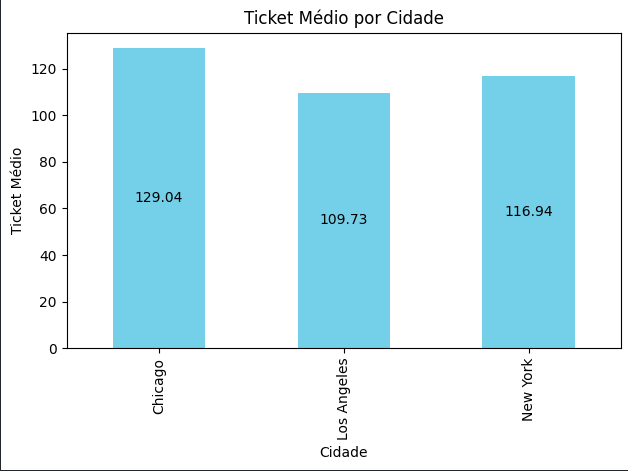
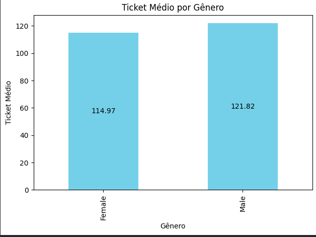
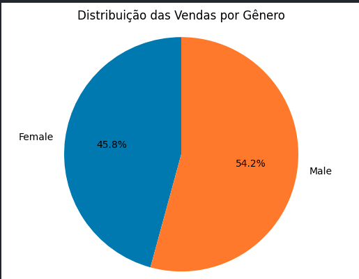
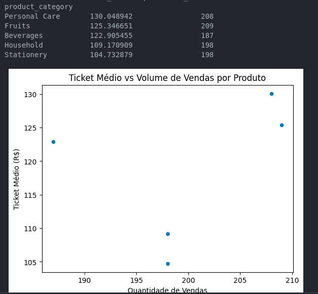

# 📊 Análise de Mercado — Exploração e Modelagem de Vendas

Este projeto explora dados de vendas ao longo do tempo, identificando padrões relevantes e construindo um modelo preditivo com Regressão Linear para auxiliar decisões de negócios.

---

## 🎯 Objetivos

- Realizar uma análise exploratória de dados de mercado
- Identificar padrões sazonais e tendências
- Treinar um modelo de Regressão Linear para prever vendas futuras
- Avaliar o desempenho do modelo com métricas estatísticas

---

## 🖼️ Visualizações

- Evolução das vendas ao longo do tempo
- Correlação entre variáveis-chave
- Padrões sazonais identificados visualmente

### Lucro Médio por Categoria


### Ticket Médio por Cidade


### Ticket Médio por Gênero e Venda Total



### Volume de Venda


### Lucro Total e Quantidade Vendida


---

## 7. 📌 Conclusões e Recomendações

## ✅ Conclusões

- P1: A categoria com mais receita foi a Personal Care e em seguida Fruits

- P2: A filial com mais ticket médio foi a de Chicago com U$129.4 de ticket médio

- P3: Homens gastam mais com um ticket médio de U$121.82 e a Mulheres com U$114.97. E podemos perceber com a analise que Homens tendem a comprar mais a categoria de Bebidas com um valor de U$11937.76 comprando 1015 unidades e 102 vendas.

- P4: Não tedas sao bem parelhas nas vendas tendo uma alta quantidade vendida e um ticket medio alto

- P5: Sim, a filial de Chicago é a mais lucriativa e com mais quantidades de itens vendidos

## 🧩 Próximos Passos

- Validar com mais dados.
- Integrar essa análise com dados de vendas futuras.


## 🧠 Tecnologias utilizadas

- Python 3.10+
- Pandas, NumPy — manipulação de dados
- Seaborn, Matplotlib — visualização de dados
- Scikit-learn — modelagem e avaliação de desempenho
- Jupyter Notebook — ambiente de análise interativa

---

## 🚀 Como executar o projeto

### 1. Clone o repositório:
```bash
git clone https://github.com/FlexxTech/analise_mercado
cd analise_mercado

2. Crie um ambiente virtual e ative:
python -m venv venv
source venv/bin/activate  # Linux/Mac
venv\Scripts\activate     # Windows

3. Instale as dependências:
pip install -r requirements.txt

4. Execute o notebook:
Abra o arquivo analise_mercado.ipynb com Jupyter:
jupyter notebook

📈 Principais descobertas

    Existe uma forte sazonalidade nos dados de vendas, especialmente nos meses finais do ano.

    A Regressão Linear obteve um erro médio aceitável, indicando potencial para previsões de curto prazo.

    A visualização temporal revela tendências consistentes que podem ser exploradas para decisões estratégicas.

📅 Próximos passos

    Incluir variáveis externas (ex: campanhas, clima, feriados)

    Explorar modelos mais robustos (Random Forest, XGBoost)

    Criar uma API com FastAPI para servir previsões em tempo real

🙋‍♂️ Autor

Feito por [FlexxTech] — entre em contato para colaborações, sugestões ou melhorias.